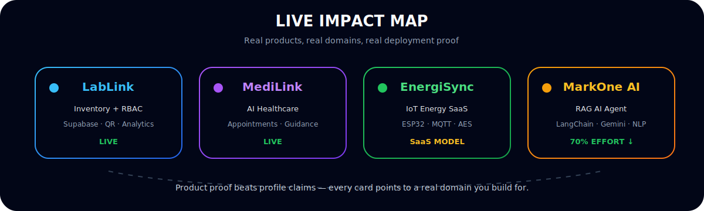
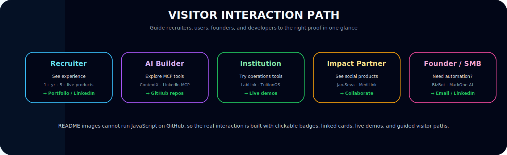
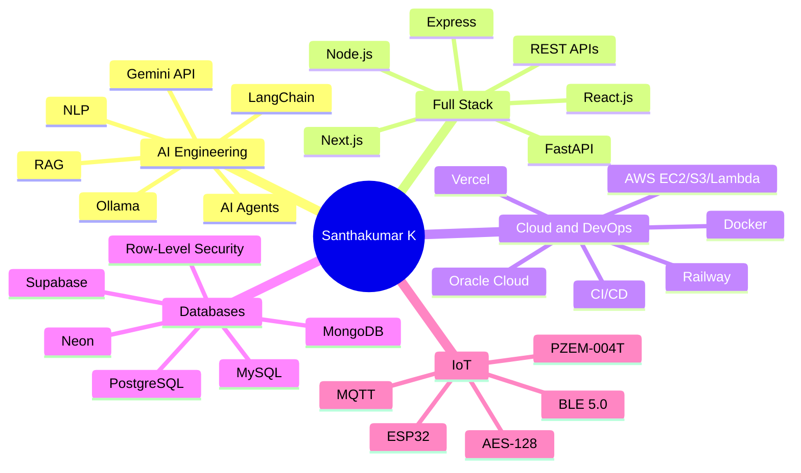
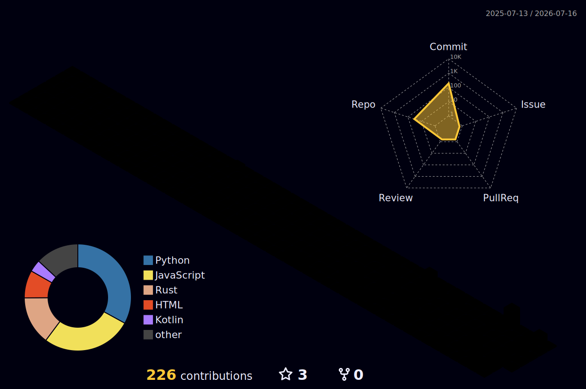
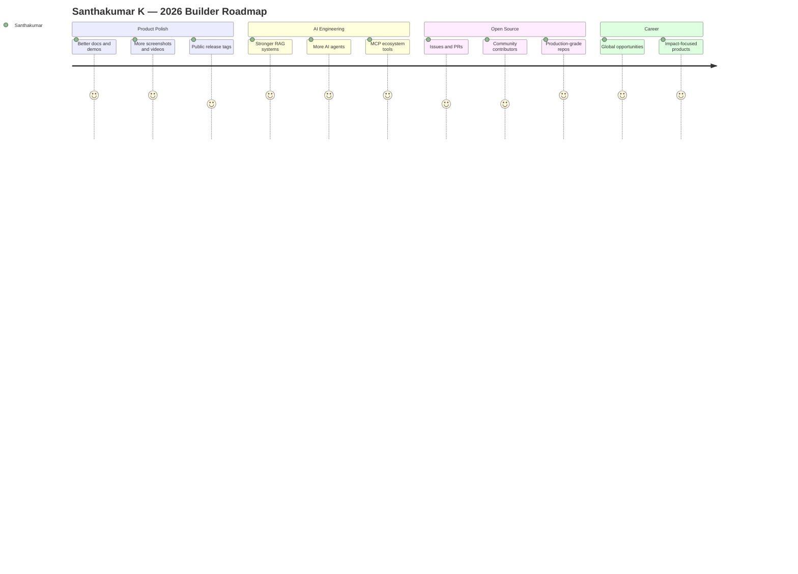

<!--
  Premium GitHub Profile README for Santhakumar K (@SanthaKumar-K-2004)
  Paste this into the README.md of your public profile repository named: SanthaKumar-K-2004

  Privacy note: your phone number was intentionally not placed in this public README.
  GitHub profiles are public and scraped. Use LinkedIn/email for contact instead.
-->

<div align="center">


<a href="https://github.com/SanthaKumar-K-2004">
  
</a>

<br />
<br />

<a href="mailto:santhakumark776@gmail.com"></a>
<a href="https://linkedin.com/in/santhakumar-k-32b9562bb"></a>
<a href="https://santhakumar-portfolio.vercel.app"></a>
<a href="https://github.com/SanthaKumar-K-2004"></a>

<br />

<a href="https://lablink-inventory.vercel.app"></a>
<a href="https://doctor1-five.vercel.app"></a>
<a href="https://gitfut.com/SanthaKumar-K-2004?country=in"></a>


</div>

<br />



<br />



<br />



<br />

---

## 🧭 Choose Your Path

Every visitor has a different goal. Click your path below to find the exact proof and details you need:

| Path | Primary Destination | Alternative Link |
| :--- | :--- | :--- |
| **👔 Recruiter** | [🌐 Visit Live Portfolio](https://santhakumar-portfolio.vercel.app) | [💼 Connect on LinkedIn](https://linkedin.com/in/santhakumar-k-32b9562bb) |
| **🤖 AI Builder / Engineer** | [🧩 Explore ContextX Intelligence](https://github.com/SanthaKumar-K-2004/ContextX-Intelligence) | [🔗 Check LinkedIn MCP Server](https://github.com/SanthaKumar-K-2004/linkedin-mcp-zero) |
| **🏫 Institution / Educator** | [🧪 Open LabLink Live App](https://lablink-inventory.vercel.app) | [📂 Browse Repositories](https://github.com/SanthaKumar-K-2004?tab=repositories) |
| **🏥 Healthcare / Impact Partner** | [🏥 Open MediLink Live App](https://doctor1-five.vercel.app) | [🏛️ Check Jan-Seva GovTech AI](https://github.com/SanthaKumar-K-2004/Jan-seva-AI) |
| **🚀 Founder / SMB Owner** | [💬 Contact via Email](mailto:santhakumark776@gmail.com) | [🤖 Check MarkOne Multi-Agent AI](https://github.com/SanthaKumar-K-2004) |

---

## 🧬 Who Am I?

```txt
Name        : Santhakumar K
Location    : Madurai, Tamil Nadu, India
Role        : Full-Stack Developer + AI Engineer + Product Builder
Education   : Diploma in Computer Science & Engineering, CGPA 10/10
Experience  : 1+ year professional experience
Focus       : AI Agents, RAG, Full-Stack SaaS, Cloud, IoT, GovTech, Healthcare Tech
Mission     : Build useful products that solve real problems for India and beyond
```

I’m a **results-driven Full-Stack Developer and AI Engineer** with experience shipping live products across **web, AI, cloud, and IoT**. I enjoy turning ideas into deployable systems — from AI chatbots and SaaS dashboards to IoT monitoring platforms and healthcare tools.

<div align="center">


</div>

---

## 🏆 Highlight Reel

<table>
<tr>
<td width="50%">

### 🌍 Global Recognition

- **Top 10 Global Finalist** — QS ImpACT Skills Challenge 2026
- Theme: **UN SDGs / Games for Good**
- Worldwide finalist recognition for impact-focused innovation

</td>
<td width="50%">

### 🎓 Academic Excellence

- **Diploma in CSE** — Government Polytechnic College, Madurai
- **Perfect CGPA: 10.00 / 10**
- Strong foundation in software engineering and computer science

</td>
</tr>
<tr>
<td width="50%">

### 🚀 Product Shipping

- Built and deployed **5+ live production products**
- Domains: AI, SaaS, Healthcare, IoT, Inventory, Automation
- Focused on real users, not only demos

</td>
<td width="50%">

### ⚽ GitFut Scouting Card

- **56 Bronze CAM**
- Playstyles: **Polyglot**, **Prolific**
- Signal: wide technical range + public shipping momentum
- View card: [GitFut Profile](https://gitfut.com/SanthaKumar-K-2004?country=in)

</td>
</tr>
</table>

---

## 🛠️ Tech Arsenal

<div align="center">

### Core Languages


### Frontend & Mobile


### Backend, AI & APIs


### Cloud, DevOps & Databases


</div>

### Specialized Strengths



---

## 🚀 Live Product Showcase

<table>
<tr>
<td width="50%">

## 🧪 [LabLink — Lab Inventory System](https://lablink-inventory.vercel.app)

**Live RBAC inventory platform** with real-time analytics, QR integration, automated low-stock alerts, and Supabase-backed data management.

**Impact:** actively usable by institutions for lab asset and inventory operations.

`Flutter` · `Supabase` · `React.js` · `Node.js` · `QR Integration` · `Vercel`

<a href="https://lablink-inventory.vercel.app"></a>

</td>
<td width="50%">

## 🏥 [MediLink — AI Healthcare Platform](https://doctor1-five.vercel.app)

AI-powered doctor-patient platform with appointment scheduling, health recommendations, and real-time communication.

**Impact:** improves accessibility and workflow for healthcare interactions.

`React.js` · `AI Recommendations` · `Scheduling` · `Realtime Communication` · `Vercel`

<a href="https://doctor1-five.vercel.app"></a>

</td>
</tr>
<tr>
<td width="50%">

## 🤖 MarkOne AI — Multi-Language GenAI Agent

RAG-powered AI chatbot with multi-language NLP, persistent context retention, and automation across WhatsApp, Email, Telegram, and Google Drive.

**Impact:** reduced workflow effort by up to **70%**.

`Python` · `LangChain` · `Gemini API` · `RAG` · `NLP` · `Telegram Bot API`

</td>
<td width="50%">

## ⚡ EnergiSync — IoT Smart Energy SaaS

Real-time energy monitoring SaaS using ESP32 + PZEM-004T, MQTT, Supabase, React Native, and AES-128 encryption.

**Business model:** ₹1,999 hardware + ₹99/month SaaS for Indian SMEs.

`ESP32` · `PZEM-004T` · `MQTT` · `Supabase` · `React Native` · `AES-128`

</td>
</tr>
<tr>
<td width="50%">

## 💬 BizBot AI — WhatsApp AI SaaS

Multi-tenant WhatsApp AI platform with PostgreSQL RLS, Gemini AI, CI/CD, and WhatsApp Cloud API.

**Market focus:** automation for India’s massive SMB ecosystem.

`WhatsApp Cloud API` · `Gemini AI` · `PostgreSQL RLS` · `CI/CD` · `SaaS Architecture`

</td>
<td width="50%">

## 🌐 [3D Portfolio](https://santhakumar-portfolio.vercel.app)

Interactive portfolio showing full-stack, AI integration, and product-building identity with modern visuals.

**Goal:** turn profile visitors into collaborators, recruiters, and users.

`React` · `Three.js` · `Tailwind CSS` · `Framer Motion` · `Vercel`

<a href="https://santhakumar-portfolio.vercel.app"></a>

</td>
</tr>
</table>

---

## 🧠 Featured Repositories

<table>
<tr>
<td width="50%">

### 🧩 [ContextX Intelligence](https://github.com/SanthaKumar-K-2004/ContextX-Intelligence)

Local-first Claude usage monitor and context token saver built as a Rust CLI with MCP tools, reversible compression, proxy support, and privacy-first design.

`Rust` · `MCP` · `AI Tools` · `Local-first` · `CLI`

</td>
<td width="50%">

### 🔗 [LinkedIn MCP Zero](https://github.com/SanthaKumar-K-2004/linkedin-mcp-zero)

Public-first MCP server for LinkedIn jobs, resumes, matching, alerts, exports, and opt-in browser intelligence.

`Python` · `MCP` · `Jobs` · `Automation` · `Claude Desktop`

</td>
</tr>
<tr>
<td width="50%">

### 🏛️ [Jan-Seva AI](https://github.com/SanthaKumar-K-2004/Jan-seva-AI)

API-first AI assistant to help Indian citizens discover government schemes, understand eligibility, and get application support.

`Python` · `GovTech` · `LLM Failover` · `Source Verification`

</td>
<td width="50%">

### 🧯 [SRE-Bench](https://github.com/SanthaKumar-K-2004/SRE)

Deterministic reinforcement-learning environment for training and evaluating AI agents on incident response workflows.

`Python` · `FastAPI` · `RL Environment` · `SRE` · `Agent Evaluation`

</td>
</tr>
</table>

---

## 📈 GitHub Intelligence Dashboard

<div align="center">


<!-- 3D contribution graph generated by .github/workflows/profile-3d.yml -->



</div>

---

## 💼 Professional Experience

### Full-Stack Developer — Allen Events

`Jul 2024 – Feb 2025` · Remote, Madurai, Tamil Nadu

- Architected a full-stack event management platform using **React.js + Node.js** for **500+ users**.
- Automated scheduling workflows and reduced manual operational effort by **60%**.
- Engineered **JWT authentication**, **RBAC**, real-time analytics dashboards, and automated reporting.
- Reduced report generation time from **hours to seconds**.

---

## 🎓 Education

<table>
<tr>
<td width="50%">

### Government Polytechnic College, Madurai

**Diploma in Computer Science & Engineering**  
`Jun 2024 – May 2026`

**CGPA: 10.00 / 10**

</td>
<td width="50%">

### Setupati Higher Secondary School, Madurai

**Higher Secondary Certificate — Science Stream**  
`May 2021`

**Score: 81.3%**

</td>
</tr>
</table>

---

## 📜 Certifications & Achievements

- 🏆 **Top 10 Global Finalist — QS ImpACT Skills Challenge 2026** · UN SDGs / Games for Good · Worldwide
- ☁️ **Oracle OCI 2025 Certified AI Foundations Associate** — Oracle University
- 🌐 **Front End Web Development: HTML5, CSS3, JavaScript** — Infosys Springboard
- 🐍 **Scientific Computing with Python** — freeCodeCamp
- 🤖 **Generative AI & Python** — GUVI / IITM
- 📊 **Google Analytics Certified**, Advanced Performance Measurement, Dataplex — Google
- ☁️ **AWS Cloud Essentials**, Cloud Computing 101, ML Foundations — Amazon Web Services
- 🔐 **Cybersecurity** — Skill India / Tech Mahindra
- 🧠 **QnA Chatbot Development** — Udemy
- 🕶️ **VIZON AR/VR/AI**

---

## 🐍 Contribution Snake

The animation below is dynamically updated by the Github Action workflow in [.github/workflows/snake.yml](file:///.github/workflows/snake.yml) every 12 hours.

<div align="center">
  
</div>

---

## 🎮 GitFut Identity

<div align="center">

<a href="https://gitfut.com/SanthaKumar-K-2004?country=in">
  
  
  
  
</a>

<br />
<br />

**My GitFut card says Bronze today. My roadmap is Gold.**  
More commits, more polished products, more open-source collaboration, more real-world impact.

</div>

---

## 🗺️ 2026 Roadmap



---

## 🤝 Let’s Connect

<div align="center">

<a href="mailto:santhakumark776@gmail.com"></a>
<a href="https://linkedin.com/in/santhakumar-k-32b9562bb"></a>
<a href="https://santhakumar-portfolio.vercel.app"></a>
<a href="https://github.com/SanthaKumar-K-2004?tab=repositories"></a>

<br />
<br />

### “I build, ship, learn, repeat — until ideas become useful products.”


</div>
